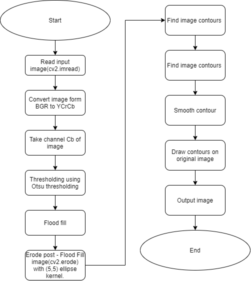

# **Installation**
    pip install -r requirements.txt

# **Description**

    coins_detection_final.py is program to recognize a certain amount of coins. I only use one channel of the YCrCb and then I deal with the distortion. I had attached a diagram of the project down below.

# **Run**

    python coins_detection_final.py 